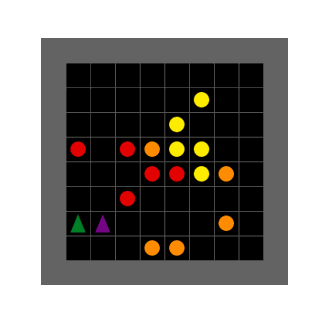

# gym-multigrid

This repo is intended to be a lightweight, multi-agent, gridworld environment. It was originally based on this [multigrid environment](https://github.com/ArnaudFickinger/gym-multigrid), but has since been heavily modified and developed beyond the scope of the original environment. Please cite this respository as well as the original repository if you use this environment in any of your projects:

```
@misc{multigrid,
  title = {Tran Research Group Gridworld Environment},
  year = {2023},
  publisher = {GitHub},
  journal = {GitHub repository},
  howpublished = {\url{https://github.com/Tran-Research-Group/trg-multigrid}},
}
```

## Getting started
To modify or contribute to this project, install gym-multigrid from source. This repo uses [poetry](https://python-poetry.org/docs/) library dependency management. To install the dependencies for this project run:
```
git clone https://github.com/Tran-Research-Group/gym-multigrid.git
cd gym-multigrid
poetry install
```

## Included environments
### Capture-the-Flag (CtF)

### Collect Game


| Attribute             | Description    |
| --------------------- | -------------- |
| Action Space          | `Discrete(4)`  |
| Observation Space     | `np.array` of shape `grid.width x grid.height` |
| Observation Encoding  |`(OBJECT_IDX, COLOR_IDX, STATE)` |
| Reward                | `(0, 1)`       |
| Number of Agents      | `2`            |
| Termination Condition | `None`         |
| Truncation Steps      | `50`           |
| Creation              | `gymnasium.make("multigrid-collect-respawn-clustered-v0")` |

Agents move around the grid to collect objects. The object respawns in a random location after being collected.

### Maze
### Wildfire


| Attribute             | Description    |
| --------------------- | -------------- |
| Actions               | `Discrete`  |
| Agent Action Space    | `Discrete(5)`  |
| Observations          | `Discrete`  |
| Observability          | `Fully observable`  |
| Agent Observation Space     | `Box([0,...],[1,...],(shape depends on number of agents,),float32)` |
| States                | `Discrete`  |
| State Space           | `Box([0,...],[1,...],(shape depends on number of agents,),float32)`  |
| Agents                | `Cooperative/Non-cooperative`       |
| Number of Agents      | `>=1`            |
| Termination Condition | `No trees on fire exist`         |
| Truncation Steps      | `>=1`           |
| Creation              | `gymnasium.make("multigrid-collect-respawn-clustered-v0")` |

Agents move over trees on fire to dump fire retardant. Initial fire is randomly located. Agents can be cooperative (shared reward) or non-cooperative (individual/group rewards). A non-cooperative agent preferentially protects a region of selfish interest within the grid. Above GIF contains two groups of agents with their selfish regions shown in same color.

## Extending multigrid
Please see this [guide](https://docs.google.com/document/d/13bCjSzRvLkdGWx7er67VQwF87pJmRIkDR41fm6iMToI/edit?usp=sharing) for creating a custom multigrid environment. See [CONTRIBUTING.md](https://github.com/Tran-Research-Group/gym-multigrid/blob/main/CONTRIBUTING.md) for our code guidelines if you are interested in adding your environment to this repo.